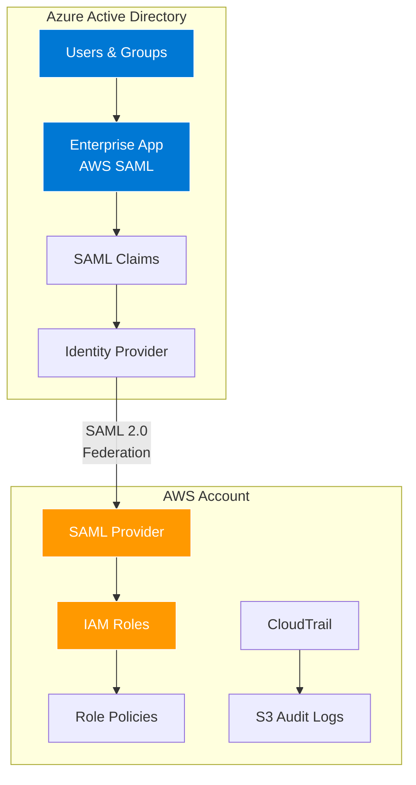

# 🌐 Hybrid Cloud Identity Management: Azure AD + AWS Integration

A production-ready implementation of federated identity management between Azure Active Directory and AWS using SAML 2.0, deployed with Infrastructure as Code.

---

## 🧩 Project Overview

This project demonstrates enterprise-grade hybrid cloud identity management, implementing Single Sign-On (SSO) between Azure AD and AWS. Built with security and compliance in mind, it showcases modern DevOps practices and cloud architecture suitable for financial services and regulated industries.

### 🔑 Key Features

- ✅ SAML 2.0 Federation between Azure AD and AWS  
- ✅ Infrastructure as Code using Terraform  
- ✅ Role-Based Access Control (RBAC) with least privilege  
- ✅ Audit logging with CloudTrail and S3  
- ✅ Multi-Factor Authentication (MFA) enforcement  
- ✅ EU data residency compliance (Frankfurt region)  
- ✅ Zero Trust Security architecture  

---

## 🏗️ Architecture



---

## ⚡ Quick Start

### ✅ Prerequisites

- Azure AD tenant (Free tier or above)  
- AWS account with administrative access  
- Terraform ≥ 1.0  
- Azure CLI  
- AWS CLI  

### 🚀 Deployment Steps

**Clone the repository**
```bash
git clone https://github.com/yourusername/hybrid-identity-project.git
cd hybrid-identity-project
```

**Deploy Azure AD Infrastructure**
```bash
cd terraform/azure
terraform init
terraform plan
terraform apply
```

**Deploy AWS Infrastructure**
```bash
cd ../aws
terraform init
terraform plan
terraform apply
```

**Configure SAML Federation**
- Download metadata from Azure AD  
- Create SAML provider in AWS  
- Configure trust relationships  

---

## 📁 Project Structure

```
hybrid-identity-project/
├── README.md                    # Project documentation
├── LICENSE                      # MIT license
├── terraform/
│   ├── azure/                   # Azure AD infrastructure
│   │   ├── main.tf              # Resource definitions
│   │   ├── variables.tf         # Input variables
│   │   └── outputs.tf           # Output values
│   └── aws/                     # AWS infrastructure
│       ├── main.tf              # IAM roles, CloudTrail
│       ├── variables.tf         # Configuration
│       └── outputs.tf           # ARNs and endpoints
├── docs/
│   ├── 01-architektur/          # Architecture documentation
│   ├── 02-implementierung/      # Implementation guides
│   ├── 03-betrieb/              # Operations manual
│   └── 04-compliance/           # Security & compliance
├── scripts/
│   ├── setup/                   # Setup automation
│   └── cleanup/                 # Resource cleanup
└── examples/
    └── saml-claims/             # SAML configuration examples
```

---

## 🔧 Technical Implementation

### 🔹 Azure AD Configuration

**Groups & Role Mapping:**

- Finance Administrators → AWS `FinanceAdmin` role  
- Developer Team → AWS `Developer` role  
- Security Auditors → AWS `SecurityAuditor` role  
- AWS Users → AWS `ReadOnly` role  

**SAML Claims Configuration:**

```xml
<Attribute Name="https://aws.amazon.com/SAML/Attributes/Role">
  <AttributeValue>arn:aws:iam::ACCOUNT:role/ROLE,arn:aws:iam::ACCOUNT:saml-provider/AzureAD</AttributeValue>
</Attribute>
<Attribute Name="https://aws.amazon.com/SAML/Attributes/RoleSessionName">
  <AttributeValue>user.userprincipalname</AttributeValue>
</Attribute>
```

---

### 🔸 AWS IAM Configuration

**Trust Policy Example:**

```json
{
  "Version": "2012-10-17",
  "Statement": [{
    "Effect": "Allow",
    "Principal": {
      "Federated": "arn:aws:iam::ACCOUNT:saml-provider/AzureAD"
    },
    "Action": "sts:AssumeRoleWithSAML",
    "Condition": {
      "StringEquals": {
        "SAML:aud": "https://signin.aws.amazon.com/saml"
      }
    }
  }]
}
```

---

## 🔐 Security Features

### 🛡️ Zero Trust Architecture

- ✅ Identity verification at every access  
- ✅ Least privilege role assignments  
- ✅ Time-based access controls  
- ✅ Comprehensive audit logging  

### 📜 Compliance & Governance

- ✅ GDPR-compliant with EU data residency  
- ✅ CloudTrail for audit requirements  
- ✅ Encrypted storage at rest  
- ✅ MFA enforcement  

---

## 🔍 Monitoring & Operations

### 🔔 CloudTrail Integration

All authentication events are logged and stored in encrypted S3 buckets:

- `AssumeRoleWithSAML` events  
- Failed authentication attempts  
- Role permission changes  
- User activity tracking  

### 📈 Key Metrics

- Authentication success rate  
- Average session duration  
- Role utilization patterns  
- Security anomaly detection  

---

## 🧪 Testing

### 🔹 Manual Testing

- Navigate to [https://myapps.microsoft.com](https://myapps.microsoft.com)  
- Sign in with test user credentials  
- Click AWS application tile  
- Verify role assumption in AWS Console  

### 🔸 Automated Testing (Coming Soon)

- Terraform validation tests  
- SAML response validation  
- Role permission verification  
- Compliance checks  

---

## 📚 Documentation

Comprehensive documentation is available in the `/docs` directory:

- Architecture Overview  
- Implementation Guide  
- Operations Manual  
- Security & Compliance  

---

## 🤝 Contributing

Contributions are welcome! Please read our **Contributing Guide** for details on our code of conduct and the process for submitting pull requests.

---

## 🪪 License

This project is licensed under the **MIT License** – see the [LICENSE](./LICENSE) file for details.

---

## 🏆 Achievements

This project demonstrates:

- ✅ Enterprise Architecture – Production-ready hybrid cloud design  
- ✅ Security Best Practices – Zero Trust, MFA, least privilege  
- ✅ Infrastructure as Code – Complete Terraform automation  
- ✅ Cloud Expertise – Deep AWS IAM and Azure AD knowledge  
- ✅ DevOps Practices – Git, CI/CD ready, documentation  

---

## 👤 Author

**Sebastian Marquez**

- [LinkedIn: Sebastian Marquez](#)  
- GitHub: [@sebastianmarquez](https://github.com/sebastianmarquez)  
- Email: sebastian.marquez.dev@gmail.com  

---

## 🙏 Acknowledgments

- AWS Documentation for SAML federation guidelines  
- Azure AD team for enterprise application templates  
- Terraform community for excellent provider documentation  

---

<div align="center">Made with ❤️ for the Cloud Engineering Community</div>


